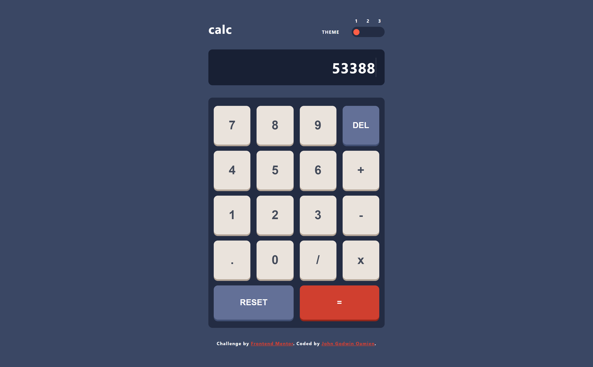
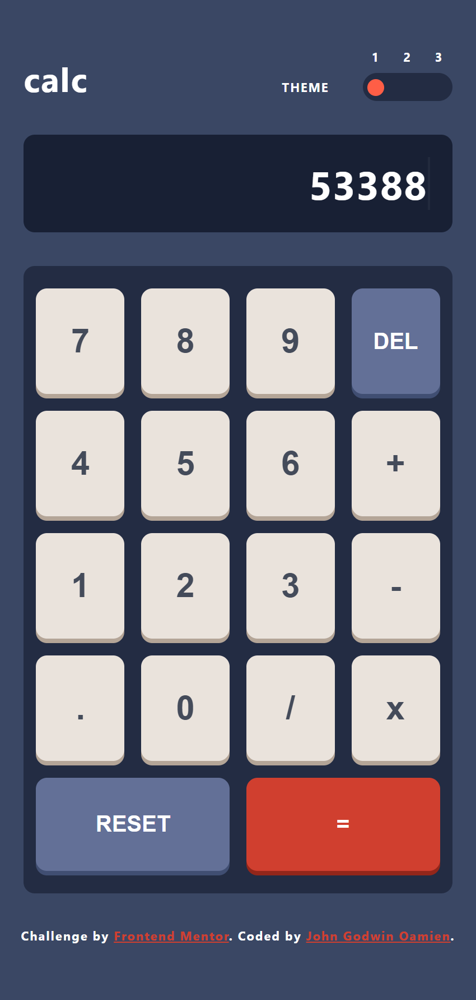

# Frontend Mentor - Calculator app solution

This is a solution to the [Calculator app challenge on Frontend Mentor](https://www.frontendmentor.io/challenges/calculator-app-9lteq5N29). Frontend Mentor challenges help you improve your coding skills by building realistic projects. 

### Desktop View

### Mobile View

### Links

- Solution URL: [solution Page on Frontend Mentor](https://your-solution-url.com)
- Live Site URL: [Live Site URL](https://calculator-app-iota-flax.vercel.app)

### Built with

- Semantic HTML5 markup
- CSS custom properties
- Flexbox
- CSS Grid
- Mobile-first workflow

## Author

- Website - [John Godwin Oamien](https://godwins-portfolio.vercel.app)
- Frontend Mentor - [Frontend Mentor Page](https://www.frontendmentor.io/profile/wariboko65)
- LinkedIn - [LinkedIn profile](https://www.linkedin.com/in/godwin-john-920915206)

